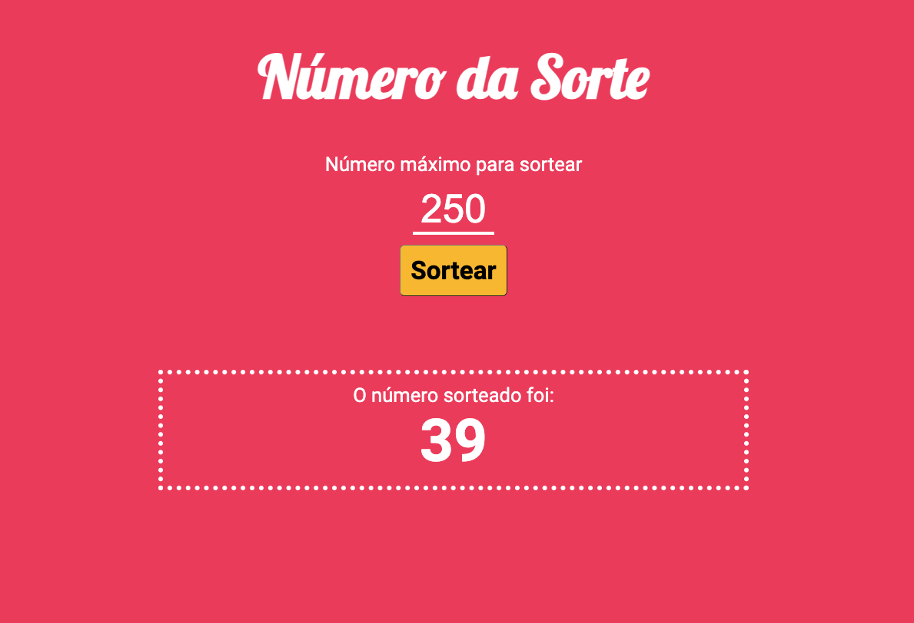

# Número da Sorte

Sorteia um número no intervalo entre 1 e o número informado pelo usuário.

Projeto desenvolvido em **HTML** e **CSS**, **JavaScript** com **LESS** e aplicação de diversos plugins do **Grunt**
para minificação de arquivos HTML, CSS e JS para o ambiente de produção.

- ``grunt-contrib-less``
- ``grunt-contrib-uglify``
- ``grunt-contrib-htmlmin``
- ``grunt-contrib-watch``
- ``grunt-replace``
- ``grunt-contrib-clean``

Projeto desenvolvido no curso de Full Stack Python da EBAC - Escola Britânica de Artes Criativas e Tecnologia.

## 🚀 Começando

Estas instruções permitirão que você obtenha uma cópia do projeto em execução em sua máquina local para fins de desenvolvimento e teste.

## Pré-requisitos

Antes de começar, certifique-se de ter as seguintes ferramentas instaladas em sua máquina:

- **Node.js**
- **npm (geralmente vem com o Node.js)**
- [VSCode](https://code.visualstudio.com/)
- [Live Server](https://github.com/ritwickdey/vscode-live-server-plus-plus)

## Instalação

Siga estas etapas a seguir para configurar o ambiente de desenvolvimento:

1. Clone este repositório em sua máquina local.
2. Navegue até o diretório clonado.
3. Instale a extensão [Live Server] no VSCode.
4. Clique em "Go Live" no canto inferior direito do VSCode para executar o projeto.
5. Execute o seguinte comando para instalar as dependências:

  **``npm install``**

## Executar o projeto

No arquivo package.json, em scripts, pode-se definir o comando desejado para o ambiente de produção
e de desenvolvimento, como por exemplo:

    "scripts": {
        "grunt": "grunt",
        "build": "grunt build",
    }

Para o ambiente de desenvolvimento, basta executar os comandos:

**``npm run grunt``**

Para o ambiente de produção, executar o comando:

**``npm run build``**

A pasta "dev" será criada com o projeto minificado.

## 🛠️ Ferramentas utilizadas para construção do projeto

* **HTML** - Linguagem de marcação utilizada na construção de páginas na Web.
* **CSS** - Cascading Style Sheets é um mecanismo para adicionar estilos a uma página web.
* **LESS** - Pré-processador para CSS, framework fácil, flexível e dinâmico para desenvolvimento web.
* **JavaScript** - Linguagem de programação interpretada estruturada, de alto nível com tipagem dinâmica fraca e multiparadigma.
* **Grunt** - Executor de tarefas JavaScript, uma ferramenta usada para executar automaticamente tarefas frequentes, como minificação, compilação, teste de unidade e linting.
* **NPM** - Gerenciador de pacotes padrão para o ambiente de tempo de execução JavaScript Node.JS.

## ✒️ Autor

Guilherme Ferreira Camargo
